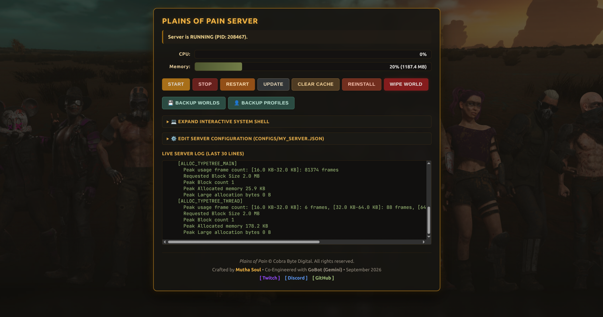

cat << 'EOF' > /root/pop-panel-git/README.md
# Plains of Pain Dedicated Server & Web Management Bundle



A turnkey deployment toolkit, CLI management tool, and lightweight web dashboard for running high-performance **Plains of Pain** dedicated servers on Linux.

* **Upstream Game Spec**: Cobra Byte Digital Linux Setup (v0.8.20 / Aug 30, 2026)
* **Author**: Mutha Soul ([Twitch](https://www.twitch.tv/mutha_soul) | [Discord](https://discord.com/channels/1100571874322305104/1545430461235601459) | [GitHub](https://github.com/Mutha-Soul))
* **Co-Engineered With**: GoBot (Gemini)
* **License**: MIT

---

## 🖥️ Operating System Support

* **Target OS**: **Debian 13 (Trixie)** — *Fully tested and optimized.*
* **Compatible Distributions**: Debian 12 (Bookworm), Ubuntu 24.04 LTS, Ubuntu 22.04 LTS.
* **Architecture**: `x86_64` (64-bit) with 32-bit multiarch enabled for SteamCMD.

---

## ⚙️ Hardware & Network Requirements

Based on official performance specifications from Cobra Byte Digital:

### Hardware Sizing
| Player Capacity | Recommended CPU | Recommended RAM | Free Disk Space |
| :--- | :--- | :--- | :--- |
| **10 Players** | 2 vCPUs | 4 GB | 500 MB+ (SSD) |
| **50 Players** | 4–6 vCPUs | 8 GB | 1 GB+ (SSD) |
| **100 Players** | 8–12 vCPUs | 16 GB | 2 GB+ (SSD) |
| **200 Players** | 16 vCPUs | 32 GB | 5 GB+ (SSD) |

### Network & Ports
* **Bandwidth**: 50–250 kbps upstream per connected player.
* **UDP 7777**: Game transport port (KCP).
* **UDP 27016**: Steam query port (Server list indexing).
* **TCP 8080**: Web dashboard port (HTTP).
* **Kernel Buffers**: UDP send/receive buffers configured up to 25 MB (`/etc/sysctl.d/99-kcp-tuning.conf`) to prevent KCP packet drops.

---

## 🚀 Quick Start

Run as `root` on a fresh Debian 13 server:

```bash
git clone [https://github.com/Mutha-Soul/plains-of-pain-server.git](https://github.com/Mutha-Soul/plains-of-pain-server.git)
cd plains-of-pain-server
chmod +x install.sh
./install.sh
pop update
Access the web control panel at http://YOUR_SERVER_IP:8080 (Default credentials: admin / ChangeMeNow123!).

🛠️ CLI Management (pop)
Manage the server directly from any terminal session:

pop start — Starts the game server service.

pop stop — Gracefully stops the game server.

pop restart — Restarts the server.

pop status — Displays real-time Systemd service telemetry.

pop update — Updates or validates game files via SteamCMD (AppID: 2227360).

pop clean — Purges stale SteamCMD appcache locks.

pop wipe — Permanently purges custom world save data to generate a fresh map.

💾 Data Backups & Paths
World state and player save data are located at:

Base Path: /home/steam/Steam/steamapps/common/PlainsOfPainServer/data/custom/main/

Worlds: .../data/custom/main/worlds

Profiles: .../data/custom/main/profiles

Web Panel Backups
The dashboard includes one-click backup buttons for both targets:

Backup Worlds: Generates a timestamped archive (worlds_backup_YYYYMMDD_HHMMSS.tar.gz)

Backup Profiles: Generates a timestamped archive (profiles_backup_YYYYMMDD_HHMMSS.tar.gz)

All archives are saved to /home/steam/backups/ under the steam system user.

🗺️ Configuration Reference (configs/my_server.json)
Default values matching Cobra Byte Digital's v0.8.20 specification:

JSON
{
  "serverName": "My Plains of Pain Server",
  "worldId": 1,
  "mapId": 1024,
  "seed": 12345,
  "difficulty": 1,
  "worldSize": 21,
  "port": 7777,
  "queryPort": 27016,
  "maxPlayers": 20,
  "ttr": 14400,
  "adminAccountIDs": ""
}
mapId: Default 1024 (Wasteland v0.8.20).

worldId: Unique world identifier. Increment by +1 to roll a new instance.

difficulty: 0 = Tourist, 1 = Rookies, 2 = True Wastelander, 3 = Veteran, 4 = Overlord.

worldSize: 11 = S, 21 = M, 31 = L, 41 = XL, 51 = XXL.

ttr: Time-to-Restart in seconds. Default 14400 (4 hours) prevents Unity JobTempAlloc memory stalls.

adminAccountIDs: Comma-separated Steam Account IDs (32-bit account IDs, not 64-bit community IDs) for in-game admin permissions.

🔍 Pre-Flight Diagnostics (Run Before Asking For Help)
If you encounter issues with the web panel, connection drops, or game startup, run this one-line diagnostic check on your VPS terminal:

Bash
echo "=== POP DIAGNOSTICS ===" && \
echo "OS: $(cat /etc/os-release | grep PRETTY_NAME | cut -d= -f2)" && \
echo "Panel Service: $(systemctl is-active pop-web.service)" && \
echo "Server Service: $(systemctl is-active pop-server.service)" && \
echo "Listening Ports:" && ss -ulpn '( sport = :7777 or sport = :27016 )' && \
echo "KCP Buffers:" && sysctl net.core.rmem_max net.core.wmem_max && \
echo "Recent Server Log:" && tail -n 15 /home/steam/Steam/steamapps/common/PlainsOfPainServer/server.log
Common Quick Fixes
Server appears as IPAddress:Port in Steam instead of its name: UDP port 27016 is blocked by your firewall. Allow inbound UDP traffic on port 27016.

Server name displays correctly, but players cannot join: UDP port 7777 is unreachable or occupied. Check port binding with ss -ulpn | grep 7777.

SteamCMD fails to validate or freezes on update: Run pop clean to purge stale .steam/appcache locks, then run pop update.

🗺️ Future Roadmap
Live Player Session Table: Integration of connection tracking once Unity KCP disconnect handling stabilizes upstream.

In-Game Moderation & RCON: Implementation of live kick, ban, and broadcast commands pending Cobra Byte Digital exposing native console hooks or IPC sockets.

Automated Map Backups: Scheduled cron-based backup archives of /data/custom to local storage or remote S3 buckets.

Custom SSL/TLS Integration: Built-in Let's Encrypt / Certbot wrapper for HTTPS access to the web dashboard.

🆘 Troubleshooting & Support Tiers
Issue Scope	Examples	Where to Get Help
Control Panel & CLI	Dashboard bugs, install.sh issues, button actions, telemetry graphs	Mutha Soul Discord • GitHub Issues • Twitch Stream
Operating System	Package manager errors, SSH access, firewall/iptables rules, VPS hosting	Debian Forums • Debian User IRC / Discord • Your VPS host
Upstream Game Bugs	JobTempAlloc leaks, scene loading latency, client crash-to-desktop, missing Steam ticket API	Official Plains of Pain Steam Community • Cobra Byte Digital Support
📄 Documentation Reference
The official upstream Linux deployment guide from Cobra Byte Digital (Plains of Pain / Dedicated Server / Linux Setup — Aug 30, 2026) is included in the docs/ directory of this repository for local reference.
EOF


---

